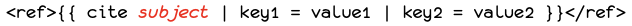
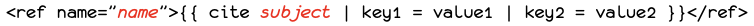
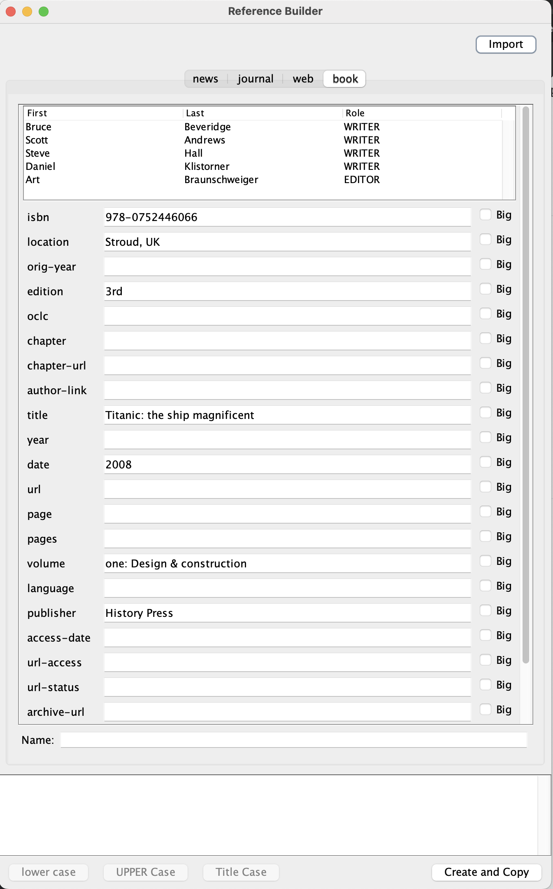
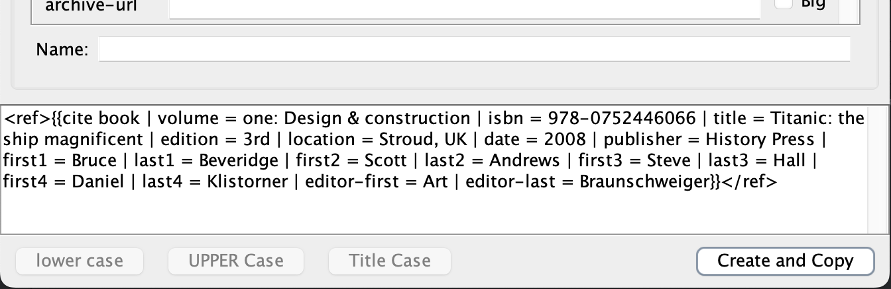
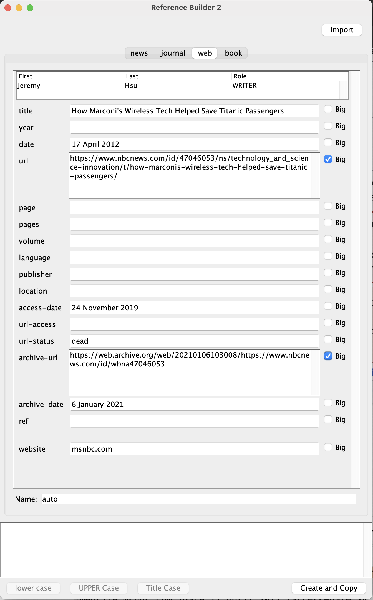

# RefBuilder
Reference Builder.

Reference Builder is an editor for Wikipedia references, which are easy to mess up.

This utility is for helping Wiki media editors such as Wikipedia. Its purpose is to help create and edit references. It can parse most existing references and load them into its editor, and it can help the user create new references from scratch.

## Reference Form
References in Wikipedia can take many forms, but the mot common ones look like one this:

or this

where  is one of four subjects: `book`, `journal`, `web`, or `news`, 

and  is the name of the reference for use in multiple references.

As you can see, the only difference between the two is the presence of an optional name in the name tag.

The bulk of the reference consists of key-value pairs, of which the example uses two.

# Building
This is a Java project using Maven as the build tool. It depends on the `Utilities` package in this same
master project, but is otherwise independent of any of the other sub projects in this project.

To build, you must have Java 17 or later installed, and a version of Maven that can handle your Java version.

To build this, first build the `Utilities` project by going to the Utilities folder and typing

`mvn clean install`

When this builds successfully, return to this project and type

`mvn clean install`

It should build a Macintosh Application, but does not bundle a JVM with the project, so you need to run it
on a Mac with Java 17 or later installed.

# Using the Application

When you launch the application, you will get a screen with all fields blank. Choose which of the four subjects you want to use and enter the data. For writers and editors, you won't find fields with those names, but at the top of the screen you'll see an empty table with columns labeled First, Last, and Role. This is where you enter as many writers and editors as the citation needs. The two roles are *Writer* and *Editor*.

If you want to edit an existing reference, you may hit the import button and paste it in. You need to paste everything from the `<ref` at the start of the reference, to the `</ref>` at the end. Then hit the *Okay* button. You'll see something like this:

Notice the table, which has four writers and one editor. It also has a blank line at the bottom, where you may add another writer or editor. If you so so, it will expand the table and leave a blank line at the bottom to add another writer or editor.

Once you have finished, you can go to the bottom, where you can hit the *Create and Copy* button to assemble the final reference from everything you've entered. It will appear at the bottom and get copied to the clipboard in a single operation, so you can immediately paste it into your Wikipedia page. For example, the page above would produce a reference like this:

Note that the authors and editor appear at the end of the reference, with key/value pairs like `first3 = Steve | last3 = Hall`. When there are more than one writer or editor, each entry for first and last name gets a number.

Sometimes the value for an key/value pair will contain too much text for you to read. In that case, you may click the "Big" checkbox next to the field to expand the field size, like in this example.

You can see that two fields have been expanded.
