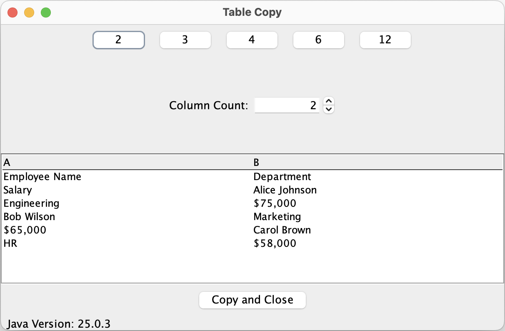
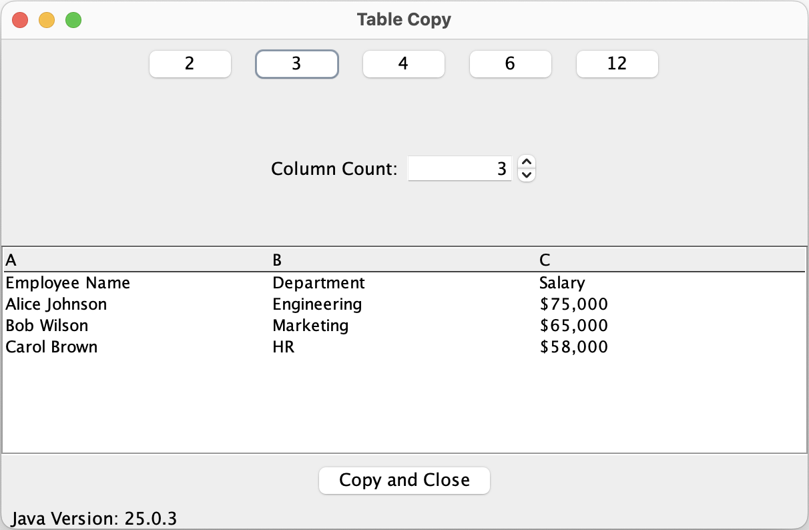

# TableTool
I wrote the Table Tool because I sometimes want to paste tabular data from a web page to Excel or some other
application, but when I do so, it often puts each table cell into its own row. (This is one of the many reasons why
I hate browser applications.) This tool modified the data on the clipboard to tab-delimited form, which Excel and
other applications can understand correctly.

However, there are at least three ways to display a table in Excel, and not all of them include information about
the structure of the table. In short, they're often missing the number of columns. So the TableTool will
present the data in a table that lets you adjust the number of columns until you get it right, before pasting into
your application.

Regardless of which kind of table your page used, the TableTool will display the table and, if needed, allow
you to adjust the number of columns.

Here we have a table with an unknown number of columns. In this case, it always starts with two column. The user may
adjust the number of columns to three by clicking the 3 button at the top, or by using the up arrow to raise the
Column Count up to three, or may replace the 2 in the Column Count field with a 3, then typing Enter or Tab.

Here's what it looks like after changing the number to 3.

Now the data fits the number of columns. At this point, you can click the "Copy and Close" button, which will copy the
adjusted table to the clipboard, then close this window. Now you can paste the code into Excel.

## Details
I know of three ways to display tabular data in Excel: I will refer to these as the Table tag, Flex tables, and 
css grid tables.
### Table tag
Tables built with the table tag work fine with copy and paste, and you won't need this tool. However, since you
often wouldn't know what kind of table was used, the TableTool will work fine with tables built with the table tag.
### Flex Tables
Flex tables will not paste correctly into Excel, but the data on the clipboard has enough information to deduce the
number of columns, so the TableTool will present the data correctly and let you copy it and paste it into excel. 
### CSS Grid Tables
There is no way to deduce the number of columns in a CSS table from the data in the clipboard. However, the TableTool
will allow you to specify the number of columns before re-copying the data. It also deduces a number of possible 
column counts, and gives you buttons to adjust the column count quickly. 

## Build Notes
Two profiles are defined in the pom.xml file for this module. They are called `thick-arm` and `thick-intel`. Each will
bundle a version of the JRE with the application, for the two kinds of processors used on the Apple Macintosh. I don't
include one for Windows because I don't have a Windows Laptop, but feel free to add one if you know how to do this.

Each build gets place in a separate target directory, which starts with the word "target."
### ARM build
(The ARM architecture is also known as Apple Silicon.)
Type the following:

    mvn clean package -P thick-arm
This will put an application in the `target-arm` directory.

### Intel build
Type the following:

    mvn clean package -P thick-intel
This will put an application in the `target-intel` directory.

### No Bundled JRE
Type the following:

    mvn clean package
This will put an application in the `target` directory.

### Multiple profiles
You can't build both thick applications in a single Maven execution. To build both, you need to execute Maven twice:

    mvn clean package -P thick-arm
    mvn clean package -P thick-intel

The second build will not delete or overwrite the result of the first build.

### Other JVM Versions
The `pom.xml` file assumes your JRE is the installed Zulu Java 25 JDK for the intel processor, or a specific version of the zulu
Java 25 JDK, in the directory at `${project.parent.basedir}/zulu25.34.17-ca-jdk25.0.3-macosx_aarch64`, where
`${project.parent.basedir}` is the directory of the parent project to this project. If you have a different version of
the JRE or JDK installed, you may specify that directory by editing the `pom.xml` file, or by overriding the value of
the `jvm-path` property on the Maven command line, like this:

    mvn clean package -P thick-intel -Djvm-path=<_path-to-your-jre_>

For example, if you use a Macintosh with the Java 17 JRE installed in the standard place, then to bundle the
thick intel JRE, you would type:

    mvn clean package -P thick-intel -Djvm-path=/Library/Java/JavaVirtualMachines/zulu-17.jdk

The code is written at a language level of 17, so any version of Java at 17 or higher should work fine.
